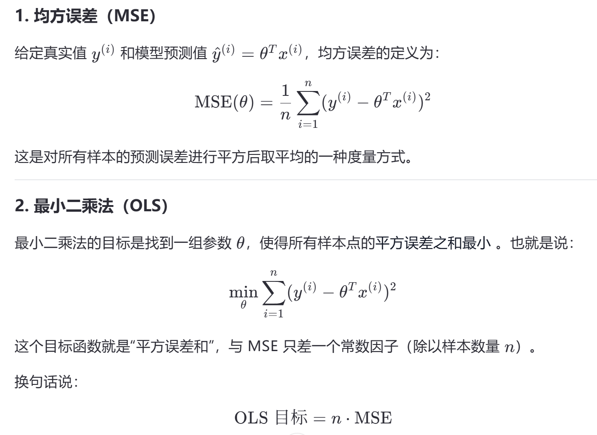
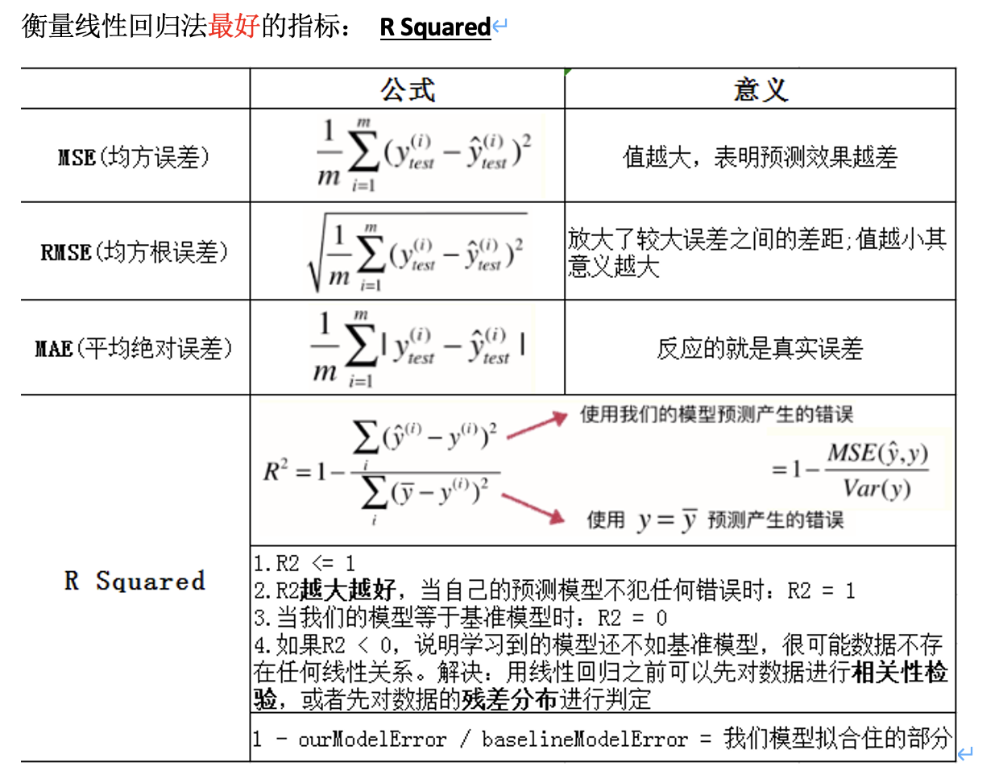
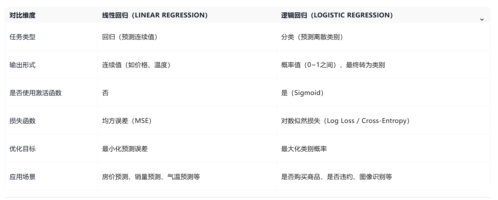
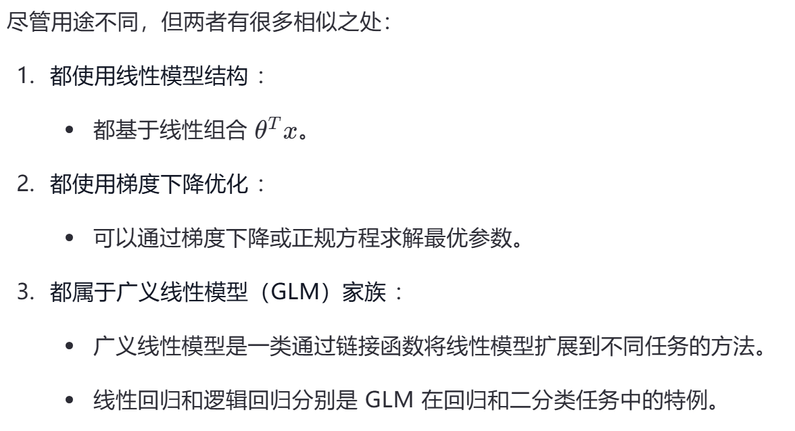
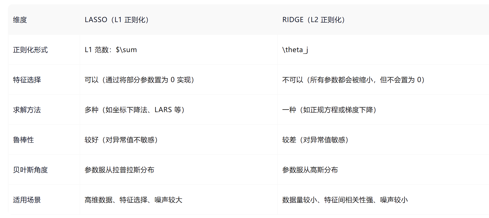
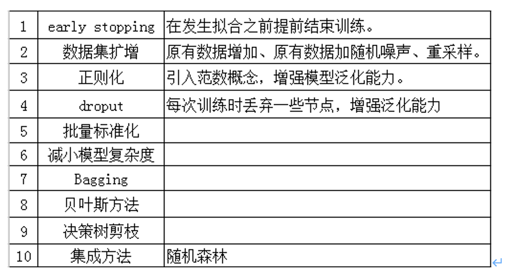
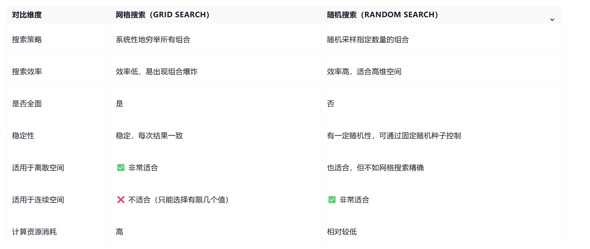
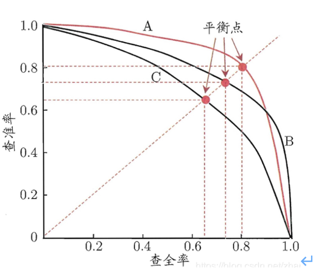

# 机器学习

## 1 机器学习基本概念
机器学习模型分为
+ 有监督学习模型
+ 无监督学习模型

###  1.1 有监督学习模型
有监督学习模型主要分为**单模型**和**集成学习**两种：
+ **单模型**使用一个独立算法处理数据来学习和预测。其特点为简单易懂，训练和预测过程透明，计算开销小、训练时间短，且易于调试定位问题。不过，它易受数据噪声和异常值影响。
+ **集成学习**则结合多个模型提升预测性能，增强鲁棒性。其优势在于能综合各模型长处，性能通常优于单模型，对噪声和异常值耐受性更好。但它也存在不足，实现与调试复杂，需管理多个模型及组合方式，训练和预测消耗更多计算资源与时间。

#### 1.1.1 单模型
- **线性模型**：
    - **线性回归**：用于建立因变量和自变量之间的线性关系，通过最小化误差平方和来确定模型参数，常用于预测数值型结果 。
    - **逻辑回归**：虽名字有“回归”，实则用于分类问题，利用对数几率函数将线性回归结果转化为概率值，判断样本所属类别。 
    - **Lasso**：在回归分析中引入L1正则化，可对系数进行压缩，实现特征选择和防止过拟合 。
    - **Ridge**：即岭回归，引入L2正则化，在回归系数估计中加入惩罚项，使系数估计更稳定，降低方差。 
- **k近邻**：基于实例的学习方法，给定测试样本，通过计算与训练集中样本的距离（如欧氏距离），找出k个最近邻样本，根据这些样本的类别（分类问题）或数值（回归问题）来预测测试样本的结果 。 
- **决策树**：
    - **ID3**：以信息增益为准则选择划分属性构建决策树，每次选择使信息增益最大的属性进行分裂。
    - **C5.0**：在ID3基础上改进，使用信息增益比，还能处理连续属性和缺失值，可生成规则集。 
    - **CART**：分类回归树，既能用于分类（二叉树，基于基尼指数选择划分属性 ），也能用于回归（基于最小平方误差 ）。 
- **神经网络**：
    - **感知机**：最简单的神经网络模型，由输入层、输出层组成，通过权重调整学习输入和输出的映射关系，可解决线性可分问题。 
    - **神经网络**：通常指多层感知机，包含多个隐藏层，能学习复杂的非线性映射关系，通过反向传播算法更新权重。 
- **支持向量机**：
    - **线性可分**：在样本线性可分情况下，寻找能最大化样本间隔的超平面进行分类。 
    - **线性支持**：针对近似线性可分情况，引入松弛变量允许部分样本出错。 
    - **线性不可分**：通过核函数将样本映射到高维空间，使其线性可分，再寻找最优超平面。 

#### 1.1.2 集成学习
- **Boosting**：
    - **GBDT**：梯度提升决策树，基于梯度下降思想，每次迭代拟合残差的近似值（负梯度 ），不断构建新决策树来提升模型性能。 
    - **AdaBoost**：通过改变样本权重，让后续弱学习器更关注之前被误分类的样本，迭代训练多个弱学习器并加权组合成强学习器。 
    - **XGBoost**：对GBDT的优化，在目标函数中加入正则项控制模型复杂度，支持并行计算，训练效率高，广泛应用于数据挖掘竞赛等领域。 
    - **LightGBM**：采用直方图算法等优化策略，减少内存占用和计算量，支持更快的并行学习，在处理大规模数据时表现出色。 
    - **CatBoost**：能自动处理类别型特征，采用排序提升算法，减少梯度估计偏差，在准确性和鲁棒性方面有不错表现。 
- **Bagging**：
    - **随机森林**：基于Bagging集成学习方法，从原始训练集有放回抽样构建多个子集，每个子集训练一棵决策树，最终通过对多棵树的预测结果进行投票（分类）或平均（回归）得到最终结果，能有效降低方差，防止过拟合。 

### 1.2 无监督学习模型
**无监督学习模型中的两个主要类别：聚类和降维。**

#### 1.2.1 聚类
+ 聚类: 是一种无监督学习技术，用于将数据集中相似的数据点分组。
  + K-means: 一种基于质心的聚类算法，通过迭代优化质心位置以最小化每个点到其所在簇中心的距离。
  + 层次聚类: 创建层次关系的聚类方法，可分为自底向上的聚合层次聚类和自顶向下的分裂层次聚类。
  + 谱聚类: 利用图论、通过计算数据点之间的相似度矩阵以进行聚类的方法。

#### 1.2.2  降维
+ 降维: 是无监督学习中的另一种方法，用于减少数据集的特征维数，同时尽量保留数据的主要信息。
  + PCA (主成分分析): 通过线性变换将数据映射到新的坐标系中，新坐标系的轴（主成分）按数据方差大小排序，以保留最大方差信息。
  + SVD (奇异值分解): 一种矩阵因子分解技术，常用于数据降维和压缩。
  + LDA (线性判别分析): 尽管通常用作监督学习，其思路也被用作降维技术，通过最大化类间分隔和最小化类内分布。

### 1.3 什么是监督学习？什么是非监督学习？
**所有的回归算法和分类算法都属于监督学习。并且明确的给给出初始值，在训练集中有特征和标签，并且通过训练获得一个模型，在面对只有特征而没有标签的数据时，能进行预测。**

+ **监督学习**：通过已有的一部分输入数据与输出数据之间的对应关系，生成一个函数，将输入映射到合适的输出，例如 分类。
+ **非监督学习**：直接对输入数据集进行建模，例如强化学习、K-means 聚类、自编码、受限波尔兹曼机。
+ **半监督学习**：综合利用有类标的数据和没有类标的数据，来生成合适的分类函数。

### 1.4 分类，回归和聚类

以下是重新制作的表格，更加清晰有序。您可以根据需要进一步调整格式：

|        分类       |                                定义                                |                       算法                       |         案例          |
|:---------------:|:------------------------------------------------------------------:|:-------------------------------------------------:|:---------------------:|
|      **分类**     |         对离散随机变量进行建模预测的监督学习                      |  LR, SVM, KNN, 决策树, 随机森林, GBDT            |      垃圾邮件分类     |
|      **回归**     |       对连续随机变量进行建模预测的监督学习                       |  非线性回归, SVR (支持向量回归->可用径向基核 (RBF)), 随机森林 |      房价预测        |
|      **聚类**     |         基于数据的内部规律，寻找其属于不同族群的无监督学习  |  Kmeans, 层次聚类, GMM (高斯混合模型)            |                     |

### 1.5 生成模式 vs 判别模式

## 2.线性模型

### 2.1 线性回归

**原理**: 用线性函数拟合数据，用 MSE（均方差） 计算损失，然后用梯度下降法(GD)找到一组使 MSE 最小的权重。

#### 2.1.1 什么是回归？哪些模型可用于解决回归问题？

**指分析因变量和自变量之间关系**

+ 线性回归: 对异常值非常敏感
+ 多项式回归: 如果指数选择不当，容易过拟合。
+ 岭回归
+ Lasso回归
+ 弹性网络回归

#### 2.1.2 线性回归的损失函数为什么是均方差?

#### 2.1.3 什么是线性回归？什么时候使用它？

利用最小二乘函数对一个或多个自变量和因变量之间关系进行建模的一种回归分析.
+ 自变量与因变量呈直线关系;
+ 因变量符合正态分布;
+ 因变量数值之间独立;
+ 方差是否齐性。

**最小二乘和均方误差之间的关系**

#### 2.1.4什么是梯度下降？SGD的推导？

#### 2.1.5什么是最小二乘法（最小平方法）？

#### 2.1.6 常见的损失函数有哪些？
1. 0-1损失  
2. 均方差损失(MSE)  
3. 平均绝对误差(MAE)   
4. 分位数损失(Quantile Loss)
分位数回归可以通过给定不同的分位点，拟合目标值的不同分位数；  
实现了分别用不同的系数控制高估和低估的损失，进而实现分位数回归。   
5. 交叉熵损失
6. 合页损失
一种二分类损失函数，SVM的损失函数本质： Hinge Loss + L2 正则化   
合页损失的公式如下：

#### 2.1.7 有哪些评估回归模型的指标？

#### 2.1.8 什么是正规方程？

#### 2.1.9 梯度下降法找到的一定是下降最快的方向吗？
不一定，它只是目标函数在当前的点的切平面上下降最快的方向。

在实际执行期中，牛顿方向（考虑海森矩阵）才一般被认为是下降最快的方向，可以达到超线性的收敛速度。梯度下降类的算法的收敛速度一般是线性甚至次线性的（在某些带复杂约束的问题）。

### 2.2 LR

也称为"对数几率回归"。

1. 分类，经典的二分类算法！
2. LR的过程：面对一个回归或者分类问题，建立代价函数，然后通过优化方法迭代求解出最优的模型参数，然后测试验证这个求解的模型的好坏。
3. **Logistic 回归虽然名字里带“回归”，但是它实际上是一种分类方法，主要用于两分类问题（即输出只有两种，分别代表两个类别）**
4. 回归模型中，y 是一个定性变量，比如 y = 0 或 1，logistic 方法主要应用于研究某些事件发生的概率。
5. **LR的本质：极大似然估计**
6. LR的激活函数：**Sigmoid**
7. LR的代价函数：交叉熵

优点：    
1. 速度快，适合二分类问题
2. 简单易于理解，直接看到各个特征的权重
3. 能容易地更新模型吸收新的数据
缺点：  
对数据和场景的适应能力有局限性，不如决策树算法适应性那么强。   

LR中最核心的概念是 Sigmoid 函数，Sigmoid函数可以看成LR的激活函数。

**Regression 常规步骤：**
1. 寻找h函数（即预测函数）
2. 构造J函数（损失函数）
3. 想办法（迭代）使得J函数最小并求得回归参数（θ）

#### 2.2.1 为什么 LR 要使用 sigmoid 函数？
1. 广义模型推导所得 
2. 满足统计的最大熵模型 
3. 性质优秀，方便使用
（Sigmoid函数是平滑的，而且任意阶可导，一阶二阶导数可以直接由函数值得到不用进行求导，这在实现中很实用）

#### 2.2.2 为什么常常要做特征组合（特征交叉）？
LR模型属于线性模型，线性模型不能很好处理非线性特征，特征组合可以引入非线性特征，提升模型的表达能力。  
另外，基本特征可以认为是全局建模，组合特征更加精细，是个性化建模，但对全局建模会对部分样本有偏，对每一个样本建模又会导致数据爆炸，过拟合，所以基本特征+特征组合兼顾了全局和个性化。    

#### 2.2.3 LR和线性回归的关系

**共同点**：

#### 2.2.4 LR参数求解的优化方法？(机器学习中常用的最优化方法)
梯度下降法，随机梯度下降法，牛顿法，拟牛顿法（LBFGS，BFGS,OWLQN）

目的都是求解某个函数的极小值。

### 2.3 Lasso

### 2.4 Ridge

### 2.5 对比

## 3.验证方式

### 3.1 什么是过拟合？产生过拟合原因?
指模型在训练集上的效果很好,在测试集上的预测效果很差.
1. 数据有噪声
2. 训练数据不足，有限的训练数据
3. 训练模型过度导致模型非常复杂

### 3.2 如何避免过拟合问题？

### 3.3 什么是机器学习的欠拟合？
模型复杂度低或者数据集太小,对模型数据的拟合程度不高,因此模型在训练集上的效果就不好.

### 3.4 如何避免欠拟合问题？
1. 增加样本的数量
2. 增加样本特征的个数
3. 可以进行特征维度扩展
4. 减少正则化参数
5. 使用集成学习方法，如Bagging

### 3.5 什么是交叉验证？交叉验证的作用是什么？
将原始dataset划分为两个部分.一部分为训练集用来训练模型,另外一部分作为测试集测试模型效果.

1. 交叉验证是用来评估模型在新的数据集上的预测效果,也可以一定程度上减小模型的过拟合
2. 还可以从有限的数据中获取尽能多的有效信息。

### 3.6 交叉验证主要有哪几种方法？
1. 留出法:简单地将原始数据集划分为训练集,验证集,测试集三个部分.
2. k折交叉验证:(一般取5折交叉验证或者10折交叉验证)
3. LOO留一法: (只留一个样本作为数据的测试集,其余作为训练集)---只适用于较少的数据集
4. Bootstrap方法:(会引入样本偏差)

### 3.7 什么是K折交叉验证？
将原始数据集划分为k个子集，将其中一个子集作为验证集，其余k-1个子集作为训练集，如此训练和验证一轮称为一次交叉验证。
交叉验证重复k次，每个子集都做一次验证集，得到k个模型，加权平均k个模型的结果作为评估整体模型的依据。

### 3.8 如何在K折交叉验证中选择K？
k越大，不一定效果越好，而且越大的k会加大训练时间；
在选择k时，需要考虑最小化数据集之间的方差，比如对于2分类任务，采用2折交叉验证，即将原始数据集对半分，若此时训练集中都是A类别，验证集中都是B类别，则交叉验证效果会非常差。

### 3.9 网格搜索（GridSearchCV）
一种调优方法，在参数列表中进行穷举搜索，对每种情况进行训练，找到最优的参数。

### 3.10 随机搜素（RandomizedSearchCV）
从超参数空间中随机采样一定数量的组合进行评估，从中选出表现最好的一组。

### 3.11 区别
网格搜索（Grid Search）和随机搜索（Random Search）都是超参数调优 的常用方法，用于在机器学习模型中寻找最优的超参数组合。虽然它们的目标相同，但在实现方式、效率、适用场景等方面有明显区别。

## 4.分类

### 4.1 几个易混淆的概念
+ 准确率（Accuracy）
+ 精准率(Precision) 
+ 召回率(Recall) 

准确率是所有判断正确的样本占所有样本的比例；   
精确率是所有判断为正例的样本中真正的正例占所有判断为正例的样本的比例；   
召回率则是所有正例中被判断出来的比率。   

### 4.2 P-R曲线

横轴为**召回率(查全率)**，纵轴为**精准率(查准率)**;  
引入“平衡点”(BEP)来度量，表示“查准率=查全率”时的取值，值越大表明分类器性能越好。

### 4.3 F1-Score

准确率和召回率的权衡: 只有在召回率Recall和精确率  

Precision都高的情况下，F1 score才会很高，比BEP更为常用。   

## 5. 正则化

### 5.1 什么是正则化？如何理解正则化？
**定义:** 在损失函数后加上一个正则化项（惩罚项），其实就是常说的结构风险最小化策略，即损失函数 加上正则化。一般模型越复杂，正则化值越大。   

正则化项是用来对模型中某些参数进行约束，正则化的一般形式：     

**第一项是损失函数（经验风险），第二项是正则化项**   

公式可以看出，加上惩罚项后损失函数的值会增大，要想损失函数最小，惩罚项的值要尽可能的小，模型参数就要尽可能的小，这样就能减小模型参数，使得模型更加简单。    

### 5.2 为何要常对数据做归一化？
1. 归一化后加快的梯度下降对最优解的速度。
2. 归一化有可能提高精度。

### 5.3 归一化和标准化的区别
标准化是依照特征矩阵的列处理数据，其通过求z-score的方法，将样本的特征值转换到同一量纲下。归一化是依照特征矩阵的行处理数据，其目的在于样本向量在点乘运算或其他核函数计算相似性时，拥有统一的标准，也就是说都转化为“单位向量”。
归一化的目的是方便比较，可以加快网络的收敛速度；标准化是将数据利用z-score（均值、方差）的方法转化为符合特定分布的数据，方便进行下一步处理，不为比较。

### 5.4 需要归一化的算法有哪些？这些模型需要归一化的主要原因？

**线性回归,逻辑回归，KNN，SVM，神经网络。** 

主要是因为特征值相差很大时，运用梯度下降，损失等高线是椭圆形，需要进行多次迭代才能达到最优点，如果进行归一化了，那么等高线就是圆形的，促使SGD往原点迭代，从而导致需要迭代次数较少。   

## 6. 决策树

